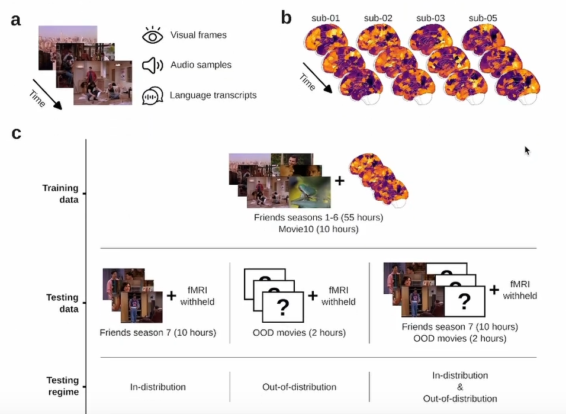

# The Algonauts Project 2025

The Algonauts Project 2025 challenge assesses computational models' ability to predict fMRI-recorded brain activity during exposure to **multimodal naturalistic movies**, leveraging a curated subset of the CNeuroMod dataset. This dataset includes:

**Training data:**

- 80 hours per subject of fMRI responses
- Episodes from Seasons 1-6 of *Friends*
- Three feature films
- One documentary

**Evaluation data:**

- Season 7 of *Friends* (in-distribution test)
- Novel movies with distinct narrative/content features (out-of-distribution generalization test)

The challenge emphasizes **OOD generalization** as the primary selection criterion for winning models, pushing beyond traditional within-distribution performance metrics. This structure enables direct comparison between biological and artificial intelligence systems' capacity to handle complex, real-world sensory inputs.

    Gifford AT, Bersch D, St-Laurent M, Pinsard B, Boyle J, Bellec L, Oliva A, Roig G, Cichy RM. 2025. The Algonauts Project 2025 Challenge: How the Human Brain Makes Sense of Multimodal Movies. arXiv preprint, arXiv:2501.00504. DOI: https://doi.org/10.48550/arXiv.2501.00504
    Boyle J, Pinsard B, Borghesani V, Paugam F, DuPre E, Bellec P. 2023. The Courtois NeuroMod project: quality assessment of the initial data release (2020). 2023 Conference on Cognitive Computational Neuroscience.

